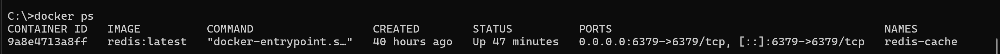

# RedisTest

Enjoy!

## Table of Contents
1. [Useful Links](#useful-links)
2. [Set Up](#set-up)
    a. [Docker](#docker)
        - [Installation and Container Creation](#installation-and-container-creation)
        - [Checking its running](#checking-its-running)
    b. [Visual Studio](#visual-studio)
3. [Coding](#coding)
    a. [Opening a connection](#opening-a-connection)
    b. [CRUD Operations](#crud-operations)
    c. [Concurrency Testing](#concurrency-testing)


## Useful links

|                     |                                                      |
|---------------------|------------------------------------------------------|
| Docker Desktop      | https://www.docker.com/                              |
| Redis Image         | https://hub.docker.com/_/redis                       |
| StackExchange.Redis | https://stackexchange.github.io/StackExchange.Redis/ |


## Set up

*Note that this is for local set up.*
<br>While I don't think any of these steps will be too disimillar when deploying to production I have not tried this!

### Docker

#### Installation and Container Creation

1. Install Docker Desktop
2. In the command line, run either of the following commands:
    a. Without password
    ```
    docker run -d --name redis-cache -p 6379:6379 redis:latest
    ```
    b. With password<br>NOTE: I have not tried this so unsure how it works but including it anyway for completeness <br>(I stole this from ChatGPT)
    ```
    # Make the folder if not exists
    New-Item -ItemType Directory -Path C:\redisdata -Force

    # Run with appendonly persistence, password, volume, and restart policy
    docker run -d --name redis-cache `
      --restart unless-stopped `
      -p 6379:6379 `
      -v C:\redisdata:/data `
      redis:latest redis-server --appendonly yes --requirepass 'YourStrongPassword'
    ```

This utilises the official redis docker image so we don't need to do anything other than use it to spin up a container.
<br>Image link: https://hub.docker.com/_/redis

#### Checking its running

This should have the docker container running Redis up and running. 
<br>To verify we can either check the desktop application and see something like:


We can also verify in the command line by running
```
docker ps
```

In the command line we should see something similar to:




### Visual Studio
This one is pretty simple, all we need is to install one package and we're ready to get coding.

Install `StackExchange.Redis`<br>
(This can be done from the NuGet package manager)

The package is developed by StackExchange (the company behind Stack Overflow) and the docs can be found [here](https://stackexchange.github.io/StackExchange.Redis/).


## Coding

The fun bit :)

### Opening a connection

The basic way:
```C#
ConnectionMultiplexer redisConnection = ConnectionMultiplexer.Connect("localhost:6379");
IDatabase db = redisConnection.GetDatabase();
```

The more configuarable (and therefore preferred) way:
```C#
// Define a ConfigurationOptions object with all the configs you want e.g.
ConfigurationOptions configurationOptions = new ConfigurationOptions {
    EndPoints = { { "localhost", 6379 } },
    ConnectRetry = 1,
    ConnectTimeout = 1000,
    SyncTimeout = 1000
};

// Create the connection
string configString = options.ToString();
ConnectionMultiplexer redisConnection = ConnectionMultiplexer.Connect(configString);
IDatabase db = redisConnection.GetDatabase();
```
Note that there are wayyyyy more options that can be added (https://stackexchange.github.io/StackExchange.Redis/Configuration).

Also this is probably a terrible design but this is just for illustration :) Just need to pass a string with the config options into `Connect()`.

For completeness, closing a connection:
```
redisConnection.Close();
```

### CRUD Operations
Before getting into examples, there are async and sync options for all the methods. I have used the sync ones below.

Redis is a no SQL data store and stores everything in key-value pairs.

#### Create and Update
The create and update process is the same as it involves writing to the same key. If the key already exists in the store then Redis will overwrite the value otherwise it will create a new entry. Also returns a `bool`.
```
db.StringSet(key, value)
```

There is a TTL option too to make an entry in Redis expire after a certain time.
```
db.StringSet(key, value, TimeSpan.FromSeconds(10))
```

#### Read
```
string value = db.StringGet(key);
```

Returns `null` if does not exist.

#### Delete
```
db.KeyDelete(key);
```

Returns a `bool` and ignores a non-existent key.

### Concurrency Testing