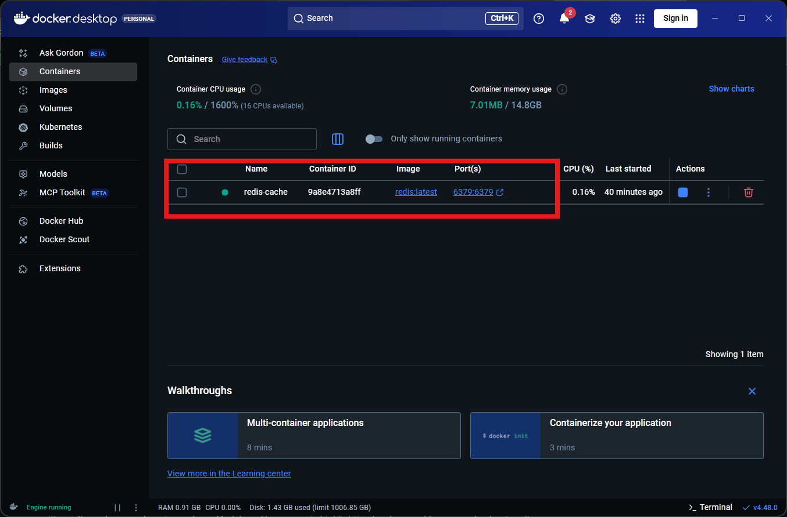

# RedisTest

## Set up (locally)
### Docker

1. Install Docker Desktop
2. In the command line, run either of the following commands:
    a. Without password
    ```
    docker run -d --name redis-cache -p 6379:6379 redis:latest
    ```
    b. With password<br>NOTE: I have not tried this so unsure how it works but including it anyway for completeness
    ```
    # Make the folder if not exists
    New-Item -ItemType Directory -Path C:\redisdata -Force

    # Run with appendonly persistence, password, volume, and restart policy
    docker run -d --name redis-cache `
      --restart unless-stopped `
      -p 6379:6379 `
      -v C:\redisdata:/data `
      redis:latest redis-server --appendonly yes --requirepass 'YourStrongPassword'
    ```

This should have the docker container running Redis up and running. To verify we can either check the desktop application and see something like:
